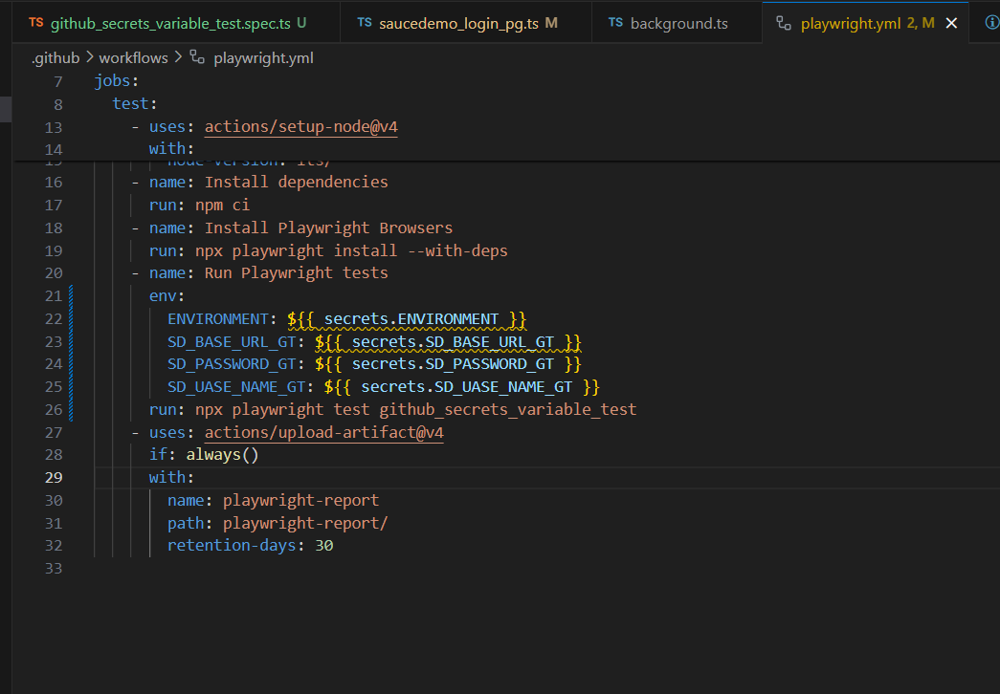
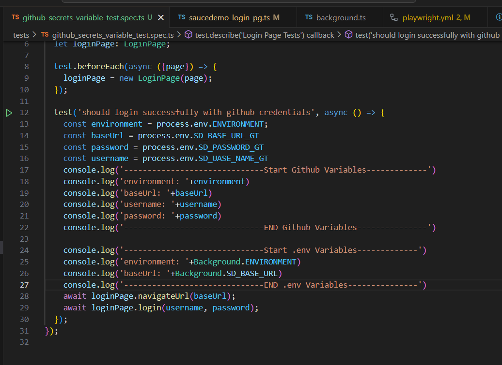

# Here's how you can access GitHub Actions secrets and variables inside your test suite:

Make sure you've defined your secrets or variables in your GitHub repository settings.

In your GitHub Actions workflow file (e.g., .github/workflows/main.yml), set up your workflow to run your tests. You can use env to pass environment variables to your job.

```
jobs:
  test:
    runs-on: ubuntu-latest
    steps:
      - name: Checkout code
        uses: actions/checkout@v2

      - name: Install dependencies
        run: npm install

      - name: Run tests
        env:
          ENVIRONMENT: ${{ secrets.ENVIRONMENT }}
        run: npm test

```

In your TypeScript test file, you can access the environment variables using process.env:

```
describe('Login Page Tests', () => {
  it('should login using credentials from environment variables', async () => {
    const environment = process.env.ENVIRONMENT;
    // Use environment variable to login or perform actions accordingly
  });
});
```
In this example, `${{ secrets.ENVIRONMENT }}` is the GitHub Actions secret or variable you've defined. It will be injected into the `process.env.ENVIRONMENT` variable when the tests run.

Ensure that your environment variables are correctly set up in your GitHub repository settings and that you're referencing them correctly in your workflow file and test script. This way, your tests will be able to utilize the secrets and variables provided by GitHub Actions during execution.



